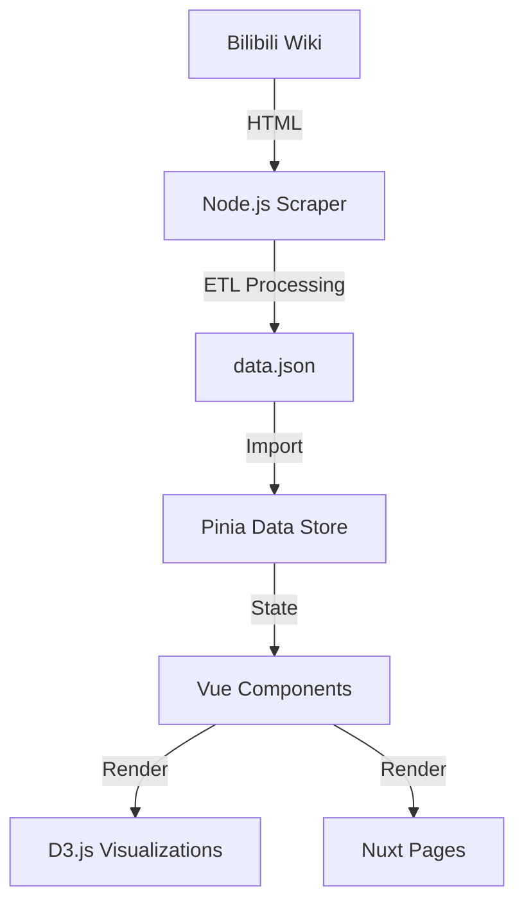

# System Architecture

## 1. Overview
The application follows a **Static Site Generation (SSG)** or **Single Page Application (SPA)** model, backed by a static JSON data file generated via an offline ETL (Extract, Transform, Load) process.



## 2. Tech Stack Setup
- **Framework**: Nuxt 3 (Vue 3 + Vite)
- **Styling**: Tailwind CSS (v4/PostCSS) + Custom CSS Variables.
- **State Management**: Pinia.
- **Visualization**: D3.js (v7).
- **Data Scripting**: TypeScript (tsx), Cheerio, Axios.

## 3. Directory Structure
```
/
├── app/
│   ├── assets/       # CSS, Fonts, Images
│   └── app.vue       # Root Component
├── components/
│   ├── viz/          # D3 Visualization Components (ScatterPlot, RadarChart)
│   └── ui/           # Reusable UI (Card, Button, Input) - Future
├── pages/
│   └── index.vue     # Main Dashboard Controller
├── public/
│   └── data.json     # Generated Data Artifact
├── scripts/
│   └── crawl.ts      # Scraper Entry Point
├── stores/
│   └── data.ts       # logic for filtering and selecting data
└── types/            # TypeScript Interfaces
```

## 4. Design Decisions
- **Why Nuxt?**: Provides auto-imports, simplified routing (if we expand), and solid TypeScript support out of the box.
- **Why D3 + Vue?**: D3 calculates the math (scales, paths), Vue handles the DOM rendering. This avoids D3 fighting Vue for DOM control.
- **Why Static JSON?**: The data changes infrequently (once per patch/season). No need for a live database. Hosted freely on GitHub Pages/Vercel.

## 5. Data Flow
1. **Build Time / Scheduled**: `npm run crawl` executes `scripts/crawl.ts`.
2. **Fetch**: Script downloads HTML from Wiki.
3. **Parse**: Cheerio extracts tables.
4. **Transform**: Logic normalizes numbers and maps types.
5. **Save**: Writes `public/data.json`.
6. **Runtime**: Client requests `/data.json` on mount (`stores/data.ts`).
7. **Reactivity**: Filter changes update `filteredWeapons` computed property, triggering D3 updates.
