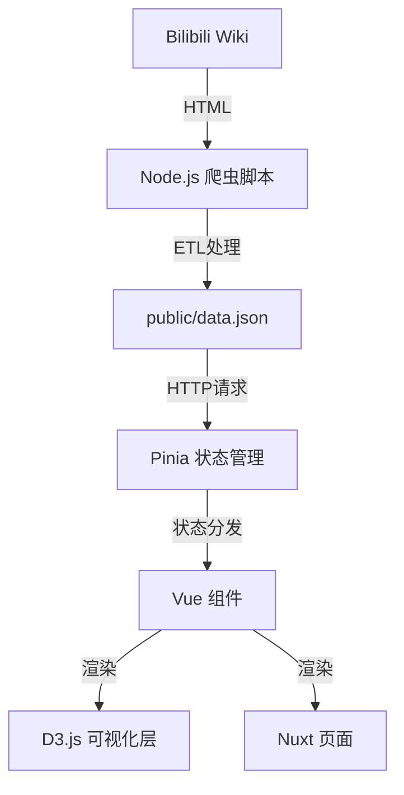

# 技术架构 (System Architecture)

## 1. 架构概览
本项目采用 **SSG (静态站点生成)** 架构。核心理念是“数据预处理”：在构建阶段（或定时任务阶段）完成繁重的数据抓取与清洗，前端只负责轻量级的 JSON 读取与渲染。



## 2. 技术栈 (Tech Stack)

### 2.1 核心框架
- **Nuxt 3**: 基于 Vue 3 的元框架。提供自动路由、TypeScript 支持及优异的构建性能。
- **Vite**: 构建工具，秒级热更新 (HMR)。

### 2.2 样式与 UI
- **Tailwind CSS (v3/v4)**: 原子化 CSS 框架。
- **PostCSS**: 处理 CSS 嵌套与自动前缀。
- **Google Fonts**: 引入 `Rajdhani` 和 `Orbitron`。

### 2.3 可视化
- **D3.js (v7)**: 工业级数据可视化库。
  - **职责**: 负责数学计算（比例尺 Scale、路径 Path 生成）、坐标轴逻辑。
  - **协作**: D3 计算数据，Vue 负责将计算结果渲染为 SVG DOM，利用 Vue 的 Diff 算法优化性能。

### 2.4 数据层
- **Cheerio**: Node.js 版 jQuery，用于服务端 HTML 解析。
- **Pinia**: Vue 的状态管理库，用于在组件间共享 `weapons` 数据及 `selectedWeapon` 选中态。

## 3. 目录结构规范
```
/
├── app/
│   ├── assets/       # 静态资源 (CSS, 图片)
│   └── app.vue       # 根组件
├── components/
│   ├── viz/          # 专用可视化组件 (ScatterPlot.vue, RadarChart.vue)
│   └── ui/           # 通用 UI 组件 (待扩展)
├── docs/             # 项目文档 (product/, develop/)
├── pages/
│   └── index.vue     # 主入口页面
├── public/
│   └── data.json     # 爬虫生成的静态数据源
├── scripts/
│   └── crawl.ts      # 爬虫/ETL 脚本入口
├── stores/
│   └── data.ts       # Pinia 数据仓库
└── types/
    └── data.d.ts     # 全局 TypeScript 类型定义
```

## 4. 关键流程
### 4.1 数据更新流程
1. 开发者或 CI/CD 运行 `npx tsx scripts/crawl.ts`。
2. 脚本请求 Wiki 页面，解析 Table。
3. 清洗数据（去除非法行、归一化数值）。
4. 覆写 `public/data.json`。
5. Git 提交该 JSON 变更。

### 4.2 前端加载流程
1. 用户访问页面。
2. `pages/index.vue` 在 `onMounted` 钩子中调用 `store.fetchData()`。
3. Store 发起 `fetch('/data.json')` 请求。
4. 数据存入 Store，计算属性 `filteredWeapons` 更新。
5. D3 组件监听数据变化，触发 `updateChart()` 重绘 SVG。
